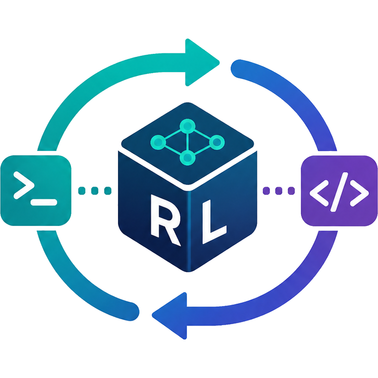

<div align="center">



# SWE-Lego-RL

**Online RL training for real coding agents — on real repositories.**

[](https://swe-lego-rl.pages.dev)
[](LICENSE)

**[Documentation](https://swe-lego-rl.pages.dev)**

SWE-Lego-RL integrates [**verl**](https://github.com/verl-project/verl) (trainer + rollout)
with [**Harbor**](https://github.com/SWE-Lego/harbor) (sandboxed task execution + verifier reward) to train an
open coding model with online RL (PPO / GRPO / GSPO) from the trajectories of a real coding agent —
**Claude Code**, **OpenHands**, **OpenCode**, or **Terminus** — solving SWE-bench-style tasks.

<br/>


</div>

---

## Overview

SWE-Lego-RL closes the loop between a **coding agent**, a **sandboxed task environment**, and an **RL trainer**:

1. **verl** serves the policy model via vLLM (managed inside the hybrid engine) and samples a batch of tasks
   from a parquet task index.
2. The custom agent loop (`BuiltinSWEAgentLoop` / `BuiltinCCAgentLoop`) launches a Harbor `Trial`: the agent
   explores a real repo inside a fresh sandbox (Kubernetes pod or Docker container), edits files, and runs tests.
3. Harbor's **verifier** runs the task's test suite and produces a reward — **1** if the issue is resolved, **0** otherwise.
4. The trajectory's chat history is tokenized into prompt/response/mask, and verl runs a PPO/GRPO/GSPO update,
   then syncs new weights back into vLLM for the next rollout.

> In short: **verl handles optimization, Harbor handles real-world task execution.**

The agent drives the **same locally-served model** it is training:

- **Claude Code** speaks the Anthropic Messages API, so `BuiltinCCAgentLoop` starts an **in-process proxy**
  that serves the Anthropic `/v1/messages` endpoint directly and forwards each call to vLLM through the rollout
  server manager. `ANTHROPIC_BASE_URL` is overridden per trial with the proxy's per-session URL, and the rollout
  trajectory (token ids / masks / logprobs) is captured straight from the proxy session — no standalone LiteLLM
  service. A human-readable `proxy_trajectory.json` is also dumped per trial for inspection.
- **OpenHands / OpenCode / Terminus** speak the OpenAI API natively and connect to vLLM directly — no proxy.

## Key Features

- **Real coding agents** — Claude Code, OpenHands (ai / sdk variants), OpenCode, Terminus 2 drive the *same* model being trained; one adapter per agent under `src/harbor_patch/agents/`, selected by the `SCAFFOLD` axis in a run config.
- **Token-fidelity rollout capture** — an **in-process vLLM proxy** (`src/verl_patch/agent_loop/vllm_chat_completion_proxy.py`) serves both the OpenAI and Anthropic `/v1/messages` surfaces and captures exact token-ids / logprobs / response-mask straight from the rollout session — no external LiteLLM. It tolerates Claude Code's mid-trajectory history rewrites (dynamic `<system-reminder>` insertion) via prefix-mismatch detection + rebuild, salvaging real logprobs for the common prefix.
- **MoE expert-routing replay (R3)** — `utils/apply_r3_vllm_patches.py` captures per-token routed experts from vLLM and replays them on the training side, so MoE models (e.g. Qwen3.5) train on the same routing they rolled out with (raised routing coverage 24% → 100%).
- **Robust trajectory filtering** — every trial is tagged with a `termination_reason` (agent_completed / timeout / overlong / max_turns / env_setup_failed); broken or over-long trajectories are dropped from the **loss** (not the batch), keeping fully-async batches alive, with partial-rollout recovery across weight syncs.
- **Multiple sandbox backends** — Kubernetes (production scale, with inline-build, lazy-pull image cache, and agent-runtime image mounting) or local/remote Docker (lightweight, no cluster).
- **Multiple training modes** — synchronous PPO/GRPO/GSPO (single- and multi-node) and **fully-async** (FSDP or Megatron) with partial-rollout & staleness control, plus a **VeOmni** hybrid engine for Qwen3.5 MoE (linear-attention).
- **No-patch integration** — all glue lives in `src/verl_patch` and `src/harbor_patch`; nothing is patched into upstream verl/Harbor.
- **One-shot setup** — `scripts/setup_env.sh` clones pinned upstreams and builds a self-contained venv.
- **Web dashboard** — `webui/` (pure-stdlib backend + React UI) charts reward/entropy/KL/MFU/lengths/val from verl logs **and** WandB, browses per-trial agent trajectories with their verifier reward, compares runs, offers an optional LLM-analysis pane, and publishes to Cloudflare Pages. Optional.

## Required Upstream Versions

For compatibility, use the upstream refs pinned in `scripts/setup_env.sh` (every URL/ref is overridable):

| Component | Source | Ref |
|---|---|---|
| **Harbor** | [SWE-Lego/harbor](https://github.com/SWE-Lego/harbor.git) | branch `ydu_dev` (harbor `0.3.1`) |
| **verl** | [Elvin-Yiming-Du/verl](https://github.com/Elvin-Yiming-Du/verl.git) | branch `ydu/swe_agent_opd_dev` (verl `0.8.0`) |

Integration code lives under `src/harbor_patch` and `src/verl_patch` — no manual patch application required.

> [!IMPORTANT]
> **The pinned verl fork is not public yet.** `scripts/setup_env.sh` clones it by default, so the
> installer will fail for anyone without access until that fork is published. It carries the VeOmni
> router-replay, R3 and fully-async fixes this repo depends on; upstream verl `0.8.0` will run the
> synchronous path but not those features. Point `VERL_REPO_URL` / `VERL_REF` at your own fork
> meanwhile:
>
> ```bash
> VERL_REPO_URL=https://github.com/verl-project/verl.git VERL_REF=v0.8.0 bash scripts/setup_env.sh
> ```

> **Harbor ref is `ydu_dev` (harbor `0.3.1`), not `main` (`0.1.45`).** `ydu_dev` carries the
> per-phase network-policy framework, the OpenHands-SDK 1.33 runtime, the OpenSWE adapter,
> and the anti-reward-hacking git-history restore hook (see below). Pin `HARBOR_REF=main`
> for the vanilla upstream.

## Anti-reward-hacking

Two orthogonal, **per-phase, default-on** defenses run inside the task environment
(`harbor_patch/environments/kubernetes/kubernetes.py`), so the agent cannot recover the gold fix
while the verifier still grades correctly. Both are driven through Harbor's `Trial.run()` phases
(env-setup → agent → verifier), which the RL rollout path goes through, so training gets them too.

| Vector | Mechanism | agent phase | verifier phase |
|---|---|---|---|
| **Network** (fetch the answer from GitHub / raw / PyPI) | iptables egress **sidecar** (`netadmin`, `NET_ADMIN`; the main container has none, so the policy can't be flushed away). CNI is flannel → k8s NetworkPolicy is a no-op, hence iptables. | `allowlist` — private LAN (in-cluster LLM proxy / registry) + DNS reachable, **public dropped** | `public` — relaxed so an online grader can reach PyPI |
| **Local git history** (`git log -p` / `show <sha>` / `checkout <sha>` / `archive` / `blame` — an open-ended list a command blacklist can't cover) | **single-commit rebuild**: `mv .git .git.orig && git init && git add -A && git commit`. The working tree is untouched (the agent still solves); the fix objects/refs simply no longer exist. Uniform across SWE-bench (fix is an ancestor of HEAD) and OpenSWE (fix on side branches). | history stripped | `.git.orig` restored (`restore_git_history()`, called from harbor `trial.py` before the verifier) so `git checkout <historical_sha> <testfile>` + `git apply <test_patch>` work |

Per-phase network is declarative via each task's `task.toml`
(`[environment]/[agent]/[verifier] network_mode = public|allowlist|no-network`); adding these keys is
backward compatible (older Harbor ignores the unknown field). The k8s env also applies a sensible
default when a task declares nothing. Toggles / knobs:

- `HARBOR_NETADMIN_IMAGE` — **required** when egress isolation is on: an image that ships `iptables`
  (an alpine base plus `apk add iptables` is enough) and that every node can pull. There is no
  default; leaving it unset raises at pod-build time rather than silently disabling the defense.
- `HARBOR_K8S_EGRESS_ISOLATION=0` — disable the network sidecar. Without it agents can reach the
  public internet and fetch the reference fix.
- `HARBOR_BLOCK_GIT_HISTORY_LEAK=0` — disable the git single-commit rebuild + restore.
- `HARBOR_NETADMIN_{CPU_REQUEST,MEM_REQUEST,MEM_LIMIT}` — sidecar resources (near-zero by default; the sidecar is a second *container in the same pod*, NOT a second pod, so it does not consume `max-pods`).

## Repository Layout

```text
.
├── src/                                          # Core Python packages
│   ├── harbor_patch/                             # Harbor adapters
│   │   ├── agents/                               # one adapter per coding agent
│   │   │   ├── image_mounted_claude_code/        #   Claude Code
│   │   │   ├── image_mounted_opencode/           #   OpenCode
│   │   │   ├── image_mounted_openhands_ai/       #   OpenHands (openhands-ai, image-mounted)
│   │   │   ├── installed_openhands_ai/           #   OpenHands (openhands-ai, installed)
│   │   │   ├── installed_openhands_sdk/          #   OpenHands (openhands-sdk, installed)
│   │   │   ├── mounted_openhands_sdk/            #   OpenHands (openhands-sdk, mounted)
│   │   │   └── terminus_2/                       #   Terminus 2
│   │   └── environments/
│   │       ├── kubernetes/kubernetes.py          # Kubernetes sandbox backend
│   │       └── remote_docker.py                  # Docker sandbox backend
│   └── verl_patch/                               # verl integration (mirrors verl layout)
│       ├── agent_loop/
│       │   ├── builtin_swe_agent_loop.py         #   generic verl ⇄ Harbor bridge
│       │   ├── builtin_cc_agent_loop.py          #   Claude Code bridge (in-process Anthropic proxy)
│       │   └── vllm_chat_completion_proxy.py     #   in-process proxy: OpenAI + Anthropic /v1/messages → vLLM
│       └── config/                               # Hydra training configs
│           ├── swe_lego_rl_sync.yaml             #   synchronous PPO/GRPO
│           ├── swe_lego_rl_fully_async_fsdp.yaml #   fully-async (FSDP)
│           ├── swe_lego_rl_fully_async_megatron.yaml
│           └── agent_loop_config_{cc,oh,oc,t2}.yaml [+ *_docker.yaml]
├── scripts/                                      # Runners: pick a template → fill a config → preflight → run
│   ├── setup_env.sh                              #   one-shot installer (clone upstreams + build venv)
│   ├── lib/                                      #   shared building blocks every runner sources
│   │   ├── site.example.env                      #     copy to site.env and describe YOUR cluster
│   │   └── preflight.sh                          #     9 classes of fail-fast pre-launch assertion
│   ├── templates/                                #   composable .env modules, one per axis
│   ├── train/{train.sh,_template.env,configs/}   #   training runner
│   ├── eval/ {eval.sh, _template.env,configs/}   #   evaluation runner
│   └── infer/{infer.sh,_template.env,configs/}   #   batch-inference runner
├── utils/                                        # Standalone Python tools (task index, R3 patches, ckpt merge)
├── webui/                                        # Optional training dashboard (stdlib backend + React UI)
├── docs/                                         # user-facing docs site (fumadocs → swe-lego-rl.pages.dev)
├── patches/                                      # pinned upstream verl patch
├── pyproject.toml
└── requirements.txt
```

## Getting Started

Every workload — training, evaluation, batch inference — is the same five steps.
Full walkthrough: **[Getting Started](https://swe-lego-rl.pages.dev/docs/getting-started)**.

```text
1. build the venv        bash scripts/setup_env.sh                       (once per machine)
2. describe the cluster  cp scripts/lib/site.example.env scripts/lib/site.env   (once per cluster)
3. copy a template       cp scripts/train/_template.env scripts/train/configs/mine.env
4. validate              PREFLIGHT_ONLY=1  then  DRY_RUN=1               (checks only, nothing launches)
5. launch                bash scripts/train/train.sh train/configs/mine.env
```

Replace `train` with `eval` (score a checkpoint) or `infer` (batch trajectory generation).

### 0. Environment setup

The one-shot installer clones both upstreams at the pinned refs and installs everything
(including this repo) into a local virtualenv:

```bash
bash scripts/setup_env.sh
```

By default it creates a venv at `<repo>/.venv` (Python 3.12.3), clones `harbor` and `verl` as
siblings of this repo, installs `harbor`, `verl`, `vllm==0.19.0`, `flash_attn`, `cupy-cuda12x`
and this repo editable, and pins `transformers==5.4.0`. Every path/URL/ref/version is
overridable and the script is **idempotent** (re-running only redoes missing steps):

```bash
WORKSPACE_ROOT=/data/src  HARBOR_REF=main  VERL_REF=v0.8.0 \
VENV_PATH=/opt/envs/swe-lego  CUDA_HOME=/usr/local/cuda-12.8 \
FLASH_ATTN_MAX_JOBS=64  FLASH_ATTN_CUDA_ARCHS=90 \
bash scripts/setup_env.sh
```

See the *User-overridable configuration* block at the top of `scripts/setup_env.sh` for the full
list. For a manual install, the runners only require `verl_patch` / `harbor_patch` to be importable
(`export PYTHONPATH="$(pwd)/src:$PYTHONPATH"` — the runners do this automatically).

### 1. Describe your cluster

Every cluster-specific value — prebuilt-image registry, image mirror, hostPath mounts, kubeconfig,
docker daemon, model/code roots — lives in one file, and **no cluster address is hardcoded anywhere
else**:

```bash
cp scripts/lib/site.example.env scripts/lib/site.env   # then edit per the comments
```

Left empty, the runners fall back to a portable vanilla path (in-pod inline build, no special
mounts, no image rewrite) — slower, but it runs anywhere.

### 2. Prepare data

Build a parquet task index from Harbor task directories with `utils/create_task_index.py`:

```bash
python utils/create_task_index.py \
  --tasks_dir /path/to/harbor_tasks \
  --output    /path/to/harbor_task_index.parquet
```

- **Indexer rule:** each immediate child of `--tasks_dir` (or `--tasks_dir` itself, for a single task) must
  contain an **`instruction.md`**. That is the only filesystem rule the indexer enforces.
- **Runtime expectation:** index paths should point to full Harbor task folders, not bare `instruction.md` stubs —
  each task dir also carries Harbor config, environment definition, solution template, and verifier tests:

  ```text
  astropy__astropy-12907/      # one task = one folder; basename → instance_id / harbor_task_path
    instruction.md             #   task prompt (required by indexer + runtime)
    task.toml                  #   Harbor metadata: verifier/agent timeouts, environment, tags
    environment/Dockerfile     #   sandbox image build
    solution/solve.sh          #   reference / grading driver
    tests/{config.json,test.sh}#   verifier configuration + entrypoint
  ```

Output rows are verl-compatible: `prompt` (placeholder), `reward_model`, and `extra_info.harbor_task_path`
(the critical bridge field).

### 3. Launch training

```bash
cp scripts/train/_template.env scripts/train/configs/mine.env   # fill in the CHANGEME lines

PREFLIGHT_ONLY=1 bash scripts/train/train.sh train/configs/mine.env   # assertions, launches nothing
DRY_RUN=1        bash scripts/train/train.sh train/configs/mine.env   # + the final launch command
                 bash scripts/train/train.sh train/configs/mine.env   # go
```

A config is ~20 lines: pick the axes (`TRAIN_MODE`, `SCAFFOLD`, `BACKEND`, `MODEL_PRESET`), set the
required fields (data, topology, naming), and everything else takes a default from `scripts/lib/`.
See [`scripts/README.md`](scripts/README.md) for the axes and parameter tiers.

## How It Works

### Agent loop bridge

`src/verl_patch/agent_loop/builtin_swe_agent_loop.py` (and the Claude Code variant
`builtin_cc_agent_loop.py`) is the key integration component. Per rollout it:

- reads `harbor_task_path` from `extra_info`,
- builds a `TrialConfig` and runs `await Trial.run()`, injecting the live vLLM `api_base`,
- extracts `all_messages` + tool metadata from the Harbor result,
- tokenizes the trajectory into `prompt_ids` / `response_ids` / `response_mask`,
- converts the verifier reward into `AgentLoopOutput.reward_score`.

### Config wiring

```
src/verl_patch/config/swe_lego_rl_sync.yaml  (or fully_async_*.yaml)
  └─ actor_rollout_ref.rollout.agent.agent_loop_config_path
       └─ src/verl_patch/config/agent_loop_config_{cc,oh,oc,t2}.yaml
            └─ _target_: verl_patch.agent_loop.BuiltinSWEAgentLoop   (per-agent loop class)
```

Each `agent_loop_config_*.yaml` injects the Harbor adapters via dynamic import — e.g. the agent adapter
(`harbor_patch.agents.image_mounted_claude_code.claude_code:...`) and the environment adapter
(`harbor_patch.environments.kubernetes.kubernetes:KubernetesEnvironment`). Trainer YAMLs resolve
`agent_loop_config_path` from `SWE_LEGO_RL_ROOT` (auto-set by the runners).

## Key Environment Variables

The runners read every path and secret from env vars with `${VAR:-default}` fallbacks. Cluster-level
values belong in `scripts/lib/site.env`; per-run values belong in the run config.

| Group | Variable | Notes |
|---|---|---|
| **Required** | `WANDB_API_KEY` | export it, or put it in `scripts/lib/.secrets.sh` (gitignored). Set `WANDB_MODE=offline`/`disabled` to opt out. **Never commit a key.** |
| **Repo / Python** | `SWE_LEGO_RL_ROOT` | consumed by Hydra configs; auto-set to repo root |
| | `PYTHONPATH` | must include `<repo>/src` (auto-set) |
| | `VENV_PATH` | venv to `source`; default `<repo>/.venv` |
| **Data / Model** | `MODEL_ROOT`, `MODEL_PATH` | model root (site) and the checkpoint to train |
| | `TRAIN_INDEX` / `TRAIN_FILES`, `VAL_INDEX` / `VAL_FILES` | parquet task indexes |
| **Distributed** | `MASTER_ADDR`, `NNODES`, `NGPUS_PER_NODE` | multi-node topology |
| | `NCCL_SOCKET_IFNAME`, `GLOO_SOCKET_IFNAME`, `TP_SOCKET_IFNAME` | network interfaces |
| **Ray** | `RAY_ADDRESS`, `RAY_PORT`, `RAY_DASHBOARD_PORT` | defaults `http://localhost:8265`, `6379`, `8265` |
| **Kubernetes** | `K8S_KUBECONFIG`/`KUBECONFIG`, `K8S_NAMESPACE`, `K8S_POD_STARTUP_TIMEOUT` | Harbor sandbox cluster |
| **Sandbox images** | `HARBOR_OPENSWE_IMAGE_REGISTRY`, `HARBOR_NYDUS_MIRROR`, `HARBOR_NETADMIN_IMAGE` | see `scripts/lib/site.example.env` |

## Docs

User-facing documentation is the [fumadocs](https://fumadocs.dev/) site under `docs/`,
published at **[swe-lego-rl.pages.dev](https://swe-lego-rl.pages.dev)** (build + deploy
with `bash docs/deploy_cloudflare_pages.sh`). It covers architecture, the runner system,
data preparation, scaling, the dashboard, and a symptom-indexed troubleshooting section.

## Agent plugin (optional)

`.claude/` ships a [Claude Code](https://claude.com/claude-code) plugin wrapping the runners:
`/rl:check` (preflight a config plus live-machine checks), `/rl:run` (launch with an explicit
parameter review), `/rl:status` (diagnose a run in flight), `/rl:dashboard` (serve the dashboard),
and `/rl:k8s-sandbox-install` (guided sandbox-cluster install). `.agents/` carries the equivalent
config skill for Codex. Everything they call is a normal shell command — the plugin is convenience,
never a requirement.

## License

[Apache License 2.0](LICENSE).

## Acknowledgement

Built on [verl](https://github.com/verl-project/verl) for RL training and [Harbor](https://github.com/SWE-Lego/harbor)
for sandboxed task execution and verifier rewards. Coding agents:
[Claude Code](https://github.com/anthropics/claude-code),
[OpenHands](https://github.com/All-Hands-AI/OpenHands),
[OpenCode](https://github.com/sst/opencode), and Terminus.
