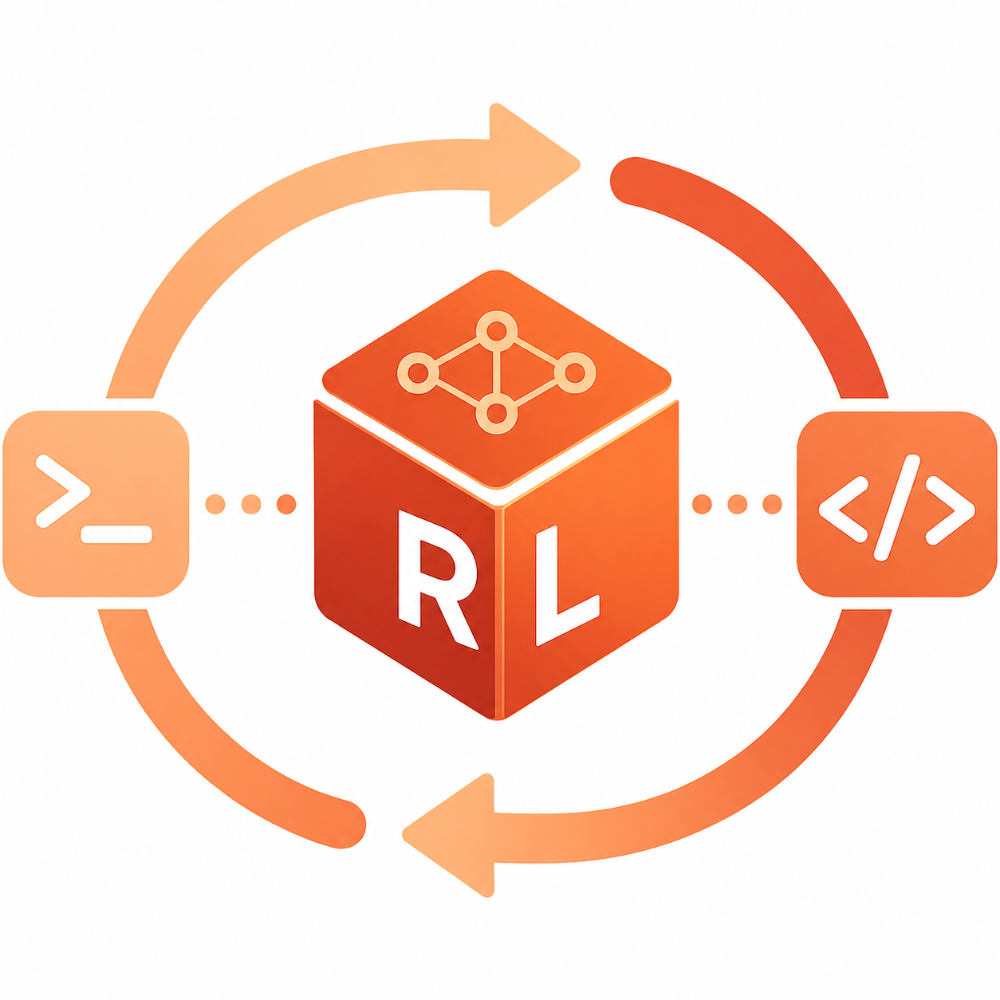
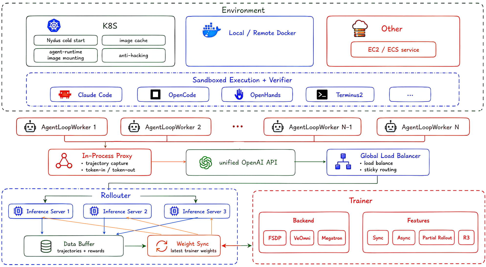
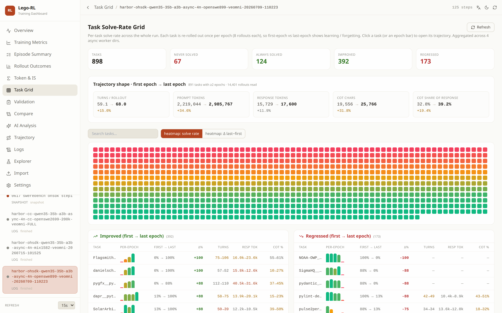
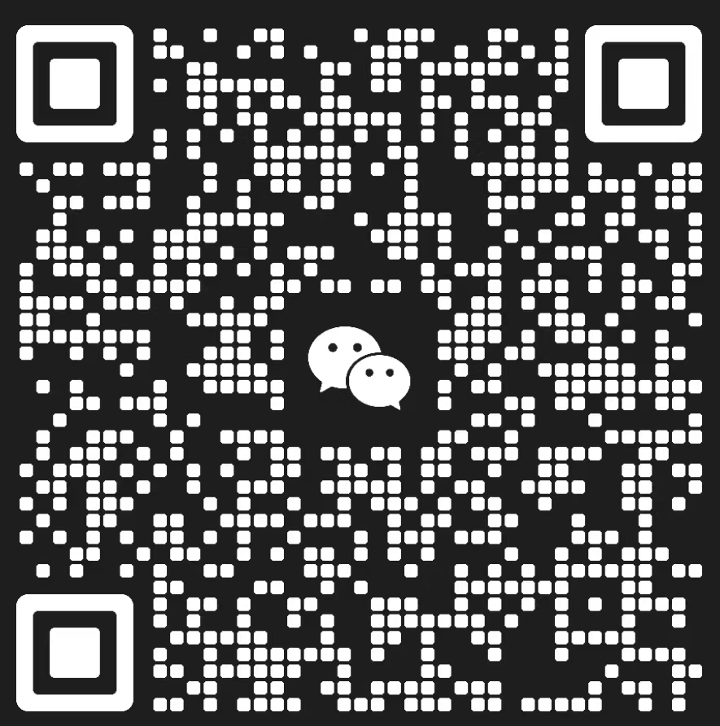

<div align="center">



# Lego-RL

**Online reinforcement learning for coding agents in their native harnesses and real repositories.**

[](https://arxiv.org/abs/2608.17393)
[](https://lego-rl.pages.dev)
[](https://legox.net/)
[](LICENSE)
[](https://github.com/Elvin-Yiming-Du/verl)
[](https://github.com/Elvin-Yiming-Du/harbor)

**[Documentation](https://lego-rl.pages.dev)** · **[Getting Started](https://lego-rl.pages.dev/docs/getting-started)** · **[Why Lego-RL](https://lego-rl.pages.dev/docs/why-lego-rl)** · **[LegoX](https://legox.net/)**

</div>

Lego-RL is an open-source framework for training coding agents with online reinforcement learning on
real software-engineering tasks. It connects **Claude Code**, **OpenHands**, and **OpenCode** to
[verl](https://github.com/verl-project/verl) while keeping each agent's native control flow.

Each run follows the same loop: an agent works on a repository task in a fresh
[Harbor](https://github.com/Elvin-Yiming-Du/harbor) sandbox, the task's verifier supplies the reward, and verl
updates the policy from the captured trajectory.

<div align="center">
 
</div>

## Live Training Dashboard

<div align="center">
 
</div>

Every run is followed live, down to the individual trial —
see the **[dashboard docs](https://lego-rl.pages.dev/docs/dashboard)**.

```bash
bash webui/start_dashboard.sh
```

## News

- [2026/08] **First public release.** Lego-RL brings Claude Code, OpenHands, and OpenCode into
  online RL on real repositories, with native harnesses, executable verifier rewards, synchronous
  or asynchronous training, and live run monitoring.

## Key Features

- **Native agents**: Claude Code, OpenHands, and OpenCode run through thin adapters. A custom
  scaffold that speaks the OpenAI or Anthropic API can use the same [agent-loop interface](https://lego-rl.pages.dev/docs/architecture/agent-loop-workers#agent-loop-classes).
- **Faithful rollouts**: an [in-process proxy](https://lego-rl.pages.dev/docs/architecture/in-process-proxy)
  records token ids, masks, and log-probabilities at generation time. It also handles history
  rewrites and serves the OpenAI and Anthropic interfaces used by the supported agents.
- **RL and scaling**: PPO, GRPO, and GSPO run on FSDP, VeOmni, or Megatron, either synchronously or
  fully asynchronously. MoE runs can use R3 routing replay, while trajectory filtering removes
  broken or over-long rollouts from the loss.
- **Sandboxed rewards**: [Kubernetes or Docker](https://lego-rl.pages.dev/docs/training-run/sandbox-backends)
  runs each task in an isolated Harbor environment. The task verifier provides the reward, with
  image caching and reward-hacking checks available for supported task sets.
- **Data and operations**: task indexes, preflight validation, and the optional `/rl:check`,
  `/rl:run`, `/rl:status`, and `/rl:dashboard` commands support the complete run lifecycle.
- **Monitoring**: the [live dashboard](https://lego-rl.pages.dev/docs/dashboard) combines training
  curves, validation, per-task results, and individual trajectories. The integration keeps the
  project glue in `src/verl_patch` and `src/harbor_patch` rather than modifying upstream packages.

## Getting Started

> [!TIP]
> Everything from installation and configuration to the full training loop and failure playbook is at
> **[lego-rl.pages.dev/docs](https://lego-rl.pages.dev/docs)**.

Install and launch the [demo run](https://lego-rl.pages.dev/docs/demo), a real training run at
1/16 scale (`8 prompts × 4 responses = 32 trials/step`):

```bash
git clone https://github.com/LegoX/Lego-RL.git && cd Lego-RL
bash scripts/setup_env.sh                                          # pinned upstreams + self-contained venv

cp scripts/train/examples/demo.env scripts/train/configs/demo.env
$EDITOR scripts/train/configs/demo.env                             # fill the CHANGEME values:
                                                                   #   checkpoint, train/val index, kubeconfig
PREFLIGHT_ONLY=1 bash scripts/train/train.sh scripts/train/configs/demo.env   # validate
bash scripts/train/train.sh scripts/train/configs/demo.env                   # launch
```

Needs 8× A100/H100-class GPUs, [uv](https://docs.astral.sh/uv/), a policy checkpoint, two task
indexes, and a reachable Kubernetes cluster (`BACKEND=docker` drives one machine's daemon instead).
The validate step launches nothing. In Claude Code the same run is `/rl:run scripts/train/configs/demo.env`.

## Community

Questions, run reports and contributions are welcome. Scan to join the WeChat group:

<div align="center">
 
</div>

## License

[Apache License 2.0](LICENSE).

## Acknowledgement

Built on [verl](https://github.com/verl-project/verl) for RL training and
[Harbor](https://github.com/Elvin-Yiming-Du/harbor) for sandboxed task execution and verifier rewards.
Coding agents: [Claude Code](https://github.com/anthropics/claude-code),
[OpenHands](https://github.com/All-Hands-AI/OpenHands),
and [OpenCode](https://github.com/sst/opencode).
</content>
