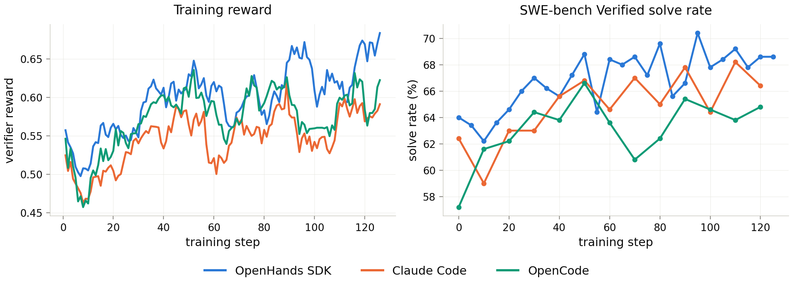

<div align="center">


# Lego-RL

**Online reinforcement learning for coding agents in their native harnesses and real repositories.**

<p align="center">
  <a href="https://arxiv.org/abs/2608.17393"> Paper</a>
  &nbsp;·&nbsp;
  <a href="https://lego-rl.pages.dev"> Docs</a>
  &nbsp;·&nbsp;
  <a href="https://huggingface.co/collections/Lego-X/lego-rl"> HuggingFace</a>
  &nbsp;·&nbsp;
  <a href="https://legox.net/"> LegoX</a>
  &nbsp;·&nbsp;
  <a href="LICENSE"> License</a>
</p>

</div>

---

Lego-RL is an open-source framework for training coding agents with online reinforcement learning on
real software-engineering tasks. It connects **Claude Code**, **OpenHands**, and **OpenCode** to
[verl](https://github.com/verl-project/verl) while keeping each agent's native control flow.

Each run follows the same loop: an agent works on a repository task in a fresh
[Harbor](https://github.com/Elvin-Yiming-Du/harbor) sandbox, the task's verifier supplies the reward, and verl
updates the policy from the captured trajectory.

<div align="center">
 
</div>

## Results

`Qwen3.5-35B-A3B` trained for three epochs (126 steps) on a [2,699-task OpenSWE-derived index](https://huggingface.co/datasets/Lego-X/Lego-RL-2699),
under three native harnesses, and evaluated on the held-out *SWE-bench Verified*:

<div align="center">
 
</div>

Verifier reward rises under every harness, and every run improves on the benchmark:
**+6.4** points with OpenHands SDK, **+5.8** with Claude Code, **+9.4** with OpenCode.

<table align="center">
<thead>
<tr><th>Coding agent</th><th>Model</th><th align="center">SWE-bench Verified (%)</th></tr>
</thead>
<tbody>
<tr><td rowspan="4"><b>OpenHands SDK</b></td><td>Qwen3.5-35B-A3B</td><td align="center">64.0</td></tr>
<tr><td>Qwen3.6-35B-A3B</td><td align="center">67.4</td></tr>
<tr><td>KAT-Coder-V2.5-Dev</td><td align="center">67.0</td></tr>
<tr><td><b>Lego-RL-Qwen3.5-35B-A3B</b></td><td align="center"><b>70.4 (+6.4)</b></td></tr>
<tr><td rowspan="4"><b>Claude Code</b></td><td>Qwen3.5-35B-A3B</td><td align="center">62.4</td></tr>
<tr><td>Qwen3.6-35B-A3B</td><td align="center">63.4</td></tr>
<tr><td>KAT-Coder-V2.5-Dev</td><td align="center">66.8</td></tr>
<tr><td><b>Lego-RL-Qwen3.5-35B-A3B</b></td><td align="center"><b>68.2 (+5.8)</b></td></tr>
<tr><td rowspan="4"><b>OpenCode</b></td><td>Qwen3.5-35B-A3B</td><td align="center">57.2</td></tr>
<tr><td>Qwen3.6-35B-A3B</td><td align="center">60.6</td></tr>
<tr><td>KAT-Coder-V2.5-Dev</td><td align="center">61.2</td></tr>
<tr><td><b>Lego-RL-Qwen3.5-35B-A3B</b></td><td align="center"><b>66.6 (+9.4)</b></td></tr>
</tbody>
</table>

All numbers are measured by us under the same harness version and evaluation protocol
(temperature 0.7, 200 turns, 200k context budget). RL on the 3.5-generation policy beats both the
next base generation and KAT-Coder-V2.5-Dev, a model post-trained from it, in all three harnesses.
The gains are also harness-specific — KAT-Coder gains 3.4 points under Claude Code, the harness its
authors report, but 0.6 under OpenCode and -0.4 under OpenHands SDK — which is exactly why Lego-RL
trains inside the harness the agent will actually run in.

Full protocol, ablations, and failure analysis are in the [paper](https://arxiv.org/abs/2608.17393).

## Live Training Dashboard

<div align="center">
 
</div>

Every run is followed live, down to the individual trial —
see the **[dashboard docs](https://lego-rl.pages.dev/docs/dashboard)**.

```bash
bash webui/start_dashboard.sh
```

## News

- [2026/08] **First public release.** Lego-RL brings Claude Code, OpenHands, and OpenCode into
  online RL on real repositories, with native harnesses, executable verifier rewards, synchronous
  or asynchronous training, and live run monitoring.

## Key Features

- **Native agents**: Claude Code, OpenHands, and OpenCode run through thin adapters. A custom
  scaffold that speaks the OpenAI or Anthropic API can use the same [agent-loop interface](https://lego-rl.pages.dev/docs/architecture/agent-loop-workers#agent-loop-classes).
- **Faithful rollouts**: an [in-process proxy](https://lego-rl.pages.dev/docs/architecture/in-process-proxy)
  records token ids, masks, and log-probabilities at generation time. It also handles history
  rewrites and serves the OpenAI and Anthropic interfaces used by the supported agents.
- **RL and scaling**: PPO, GRPO, and GSPO run on FSDP, VeOmni, or Megatron, either synchronously or
  fully asynchronously. MoE runs can use R3 routing replay, while trajectory filtering removes
  broken or over-long rollouts from the loss.
- **Sandboxed rewards**: [Kubernetes or Docker](https://lego-rl.pages.dev/docs/training-run/sandbox-backends)
  runs each task in an isolated Harbor environment. The task verifier provides the reward, with
  image caching and reward-hacking checks available for supported task sets.
- **Data and operations**: task indexes, preflight validation, and the optional `/rl:check`,
  `/rl:run`, `/rl:status`, and `/rl:dashboard` commands support the complete run lifecycle.
- **Monitoring**: the [live dashboard](https://lego-rl.pages.dev/docs/dashboard) combines training
  curves, validation, per-task results, and individual trajectories. The integration keeps the
  project glue in `src/verl_patch` and `src/harbor_patch` rather than modifying upstream packages.

## Getting Started

> [!TIP]
> Everything from installation and configuration to the full training loop and failure playbook is at
> **[lego-rl.pages.dev/docs](https://lego-rl.pages.dev/docs)**.

Install and launch the [demo run](https://lego-rl.pages.dev/docs/demo), a real training run at
1/16 scale (`8 prompts × 4 responses = 32 trials/step`):

```bash
git clone https://github.com/LegoX/Lego-RL.git && cd Lego-RL
bash scripts/setup_env.sh                                          # pinned upstreams + self-contained venv

cp scripts/train/examples/demo.env scripts/train/configs/demo.env
$EDITOR scripts/train/configs/demo.env                             # fill the CHANGEME values:
                                                                   #   checkpoint, train/val index, kubeconfig
PREFLIGHT_ONLY=1 bash scripts/train/train.sh scripts/train/configs/demo.env   # validate
bash scripts/train/train.sh scripts/train/configs/demo.env                   # launch
```

Needs 8× A100/H100-class GPUs, [uv](https://docs.astral.sh/uv/), a policy checkpoint, two task
indexes, and a reachable Kubernetes cluster (`BACKEND=docker` drives one machine's daemon instead).
The validate step launches nothing. In Claude Code the same run is `/rl:run scripts/train/configs/demo.env`.

## Community

Questions, run reports and contributions are welcome. Scan to join the WeChat group:

<div align="center">
 
</div>

## License

[Apache License 2.0](LICENSE).

## Acknowledgement

Built on [verl](https://github.com/verl-project/verl) for RL training and
[Harbor](https://github.com/Elvin-Yiming-Du/harbor) for sandboxed task execution and verifier rewards.
Coding agents: [Claude Code](https://github.com/anthropics/claude-code),
[OpenHands](https://github.com/All-Hands-AI/OpenHands),
and [OpenCode](https://github.com/sst/opencode).

## Citation

```bibtex
@misc{du2026legorlharnessnativereinforcementlearning,
  title={LEGO-RL: Harness-Native Reinforcement Learning for Coding Agents},
  author={Yiming Du and Yuxin Jiang and Tao Yuan and Jianbo Dai and Shaowei Wang and Jierun Chen and Chaofan Tao and Xianzhi Yu and Lifeng Shang and Kam-Fai Wong and Xiaohui Li and Haoli Bai},
  year={2026},
  eprint={2608.17393},
  archivePrefix={arXiv},
  primaryClass={cs.AI},
  url={https://arxiv.org/abs/2608.17393},
}
```
