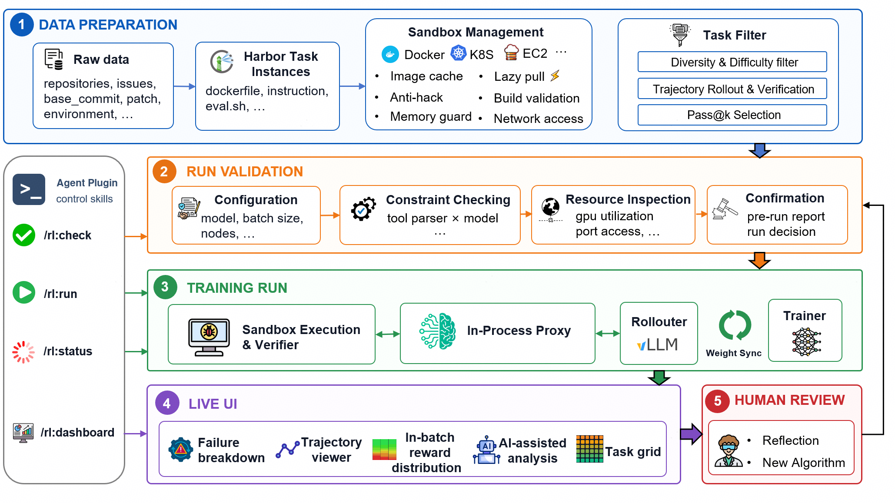
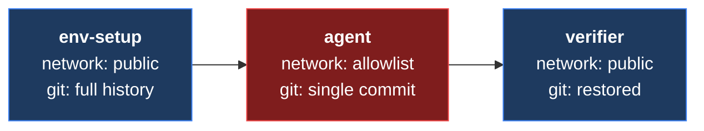
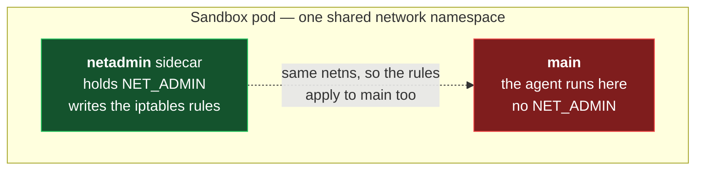

<div align="center">


# Lego-RL

**Online RL training for real coding agents — on real repositories.**

[](https://lego-rl.pages.dev)
[](LICENSE)

**[Documentation](https://lego-rl.pages.dev)**

Lego-RL integrates [**verl**](https://github.com/verl-project/verl) (trainer + rollout)
with [**Harbor**](https://github.com/SWE-Lego/harbor) (sandboxed task execution + verifier reward) to train an
open coding model with online RL (PPO / GRPO / GSPO) from the trajectories of a real coding agent —
**Claude Code**, **OpenHands**, **OpenCode**, or **Terminus** — solving SWE-bench-style tasks.

<br/>



</div>

---

## Overview

Each rollout is one real task, solved end to end inside a sandbox:

1. **verl** serves the policy via vLLM and samples tasks from a parquet index.
2. The agent loop launches a Harbor `Trial` — the agent explores a real repo in a fresh
   sandbox (Kubernetes pod or Docker container), edits files, runs tests.
3. Harbor's **verifier** runs the task's own test suite: reward **1** if the issue is resolved, **0** otherwise.
4. The trajectory is tokenized into prompt/response/mask, verl runs a PPO/GRPO/GSPO update,
   and the new weights sync back into vLLM.

> **verl handles optimization, Harbor handles real-world task execution.**

The agent always drives the *same locally-served model it is training*. OpenHands, OpenCode
and Terminus speak the OpenAI API and connect to vLLM directly; Claude Code speaks the
Anthropic Messages API, so its loop starts an in-process proxy serving `/v1/messages` and
captures the rollout trajectory straight from that session.

## Key Features

- **Real coding agents** — Claude Code, OpenHands (ai / sdk), OpenCode and Terminus 2 drive the *same* model being trained; one adapter per agent under `src/harbor_patch/agents/`, picked by the `SCAFFOLD` axis.
- **Token-fidelity rollout capture** — an in-process vLLM proxy serves both the OpenAI and Anthropic surfaces and captures exact token-ids / logprobs / response-mask from the rollout session, with no external LiteLLM. It survives Claude Code's mid-trajectory history rewrites via prefix-mismatch detection and rebuild.
- **MoE expert-routing replay (R3)** — captures per-token routed experts from vLLM and replays them on the training side, so MoE models train on the routing they rolled out with (routing coverage 24% → 100%).
- **Robust trajectory filtering** — every trial carries a `termination_reason`; broken or over-long trajectories are dropped from the **loss**, not the batch, keeping fully-async batches alive with partial-rollout recovery across weight syncs.
- **Anti-reward-hacking** — per-phase network isolation and a git-history rebuild stop the agent recovering the reference fix, while the verifier still grades correctly. [Details below](#anti-reward-hacking).
- **Multiple backends and modes** — Kubernetes (production scale) or Docker (no cluster); synchronous PPO/GRPO/GSPO and fully-async (FSDP or Megatron) with staleness control, plus a VeOmni hybrid engine for Qwen3.5 MoE.
- **No-patch integration** — all glue lives in `src/verl_patch` and `src/harbor_patch`; nothing is patched into upstream verl/Harbor.
- **Web dashboard** — optional `webui/` charts reward/entropy/KL/MFU/val from verl logs and WandB, browses per-trial trajectories with their verifier reward, and compares runs.

## Getting Started

Every workload — training, evaluation, batch inference — is the same five steps.
Full walkthrough: **[Getting Started](https://lego-rl.pages.dev/docs/getting-started)**.

```text
1. build the venv        bash scripts/setup_env.sh                              (once per machine)
2. describe the cluster  cp scripts/lib/site.example.env scripts/lib/site.env   (once per cluster)
3. copy a template       cp scripts/train/_template.env scripts/train/configs/mine.env
4. validate              PREFLIGHT_ONLY=1  then  DRY_RUN=1                      (checks only, launches nothing)
5. launch                bash scripts/train/train.sh train/configs/mine.env
```

Replace `train` with `eval` (score a checkpoint) or `infer` (batch trajectory generation).

### Prerequisites

- **8× GPU** (A100/H100-class) on the training node.
- **A sandbox backend** — a reachable Kubernetes cluster (production) or a Docker daemon (local or remote).
- **[uv](https://docs.astral.sh/uv/)**, a policy checkpoint, and task-environment images your cluster can pull.

### 1. Build the venv

```bash
bash scripts/setup_env.sh
```

Creates a venv at `<repo>/.venv` (Python 3.12.3), clones `harbor` and `verl` as siblings of this
repo, installs them plus `veomni==0.1.11`, `vllm==0.19.0`, `flash_attn`, `cupy-cuda12x` and this
repo editable, and pins `transformers==5.4.0`. Before exiting it verifies the result — veomni's
training-path modules must import, and `verl` / `harbor` must resolve to the checkouts it just
installed — so it aborts rather than leaving you a venv that looks fine but runs the wrong code.
Idempotent — re-running only redoes missing steps. Every path, URL, ref and version is overridable:

```bash
WORKSPACE_ROOT=/data/src  VENV_PATH=/opt/envs/swe-lego  CUDA_HOME=/usr/local/cuda-12.8 \
FLASH_ATTN_MAX_JOBS=64  FLASH_ATTN_CUDA_ARCHS=90 \
bash scripts/setup_env.sh
```

The pinned upstreams (see the *User-overridable configuration* block at the top of the script):

| Component | Source | Ref | Cloned to |
|---|---|---|---|
| **Harbor** | [SWE-Lego/harbor](https://github.com/SWE-Lego/harbor.git) | branch `ydu_dev` (harbor `0.3.1`) | `<repo>/../harbor` |
| **verl** | [Elvin-Yiming-Du/verl](https://github.com/Elvin-Yiming-Du/verl.git) | branch `ydu/merge-yt-20260729` (verl `0.8.0`) | `<repo>/../verl-swe_agent_opd_dev` |

The verl directory name is **not** cosmetic: `scripts/lib/common_env.sh` prepends that same path to
`PYTHONPATH` at run time, so training must find the tree that was installed. Both sides derive it
from the repo location, so a checkout anywhere works — but override only one of them and you get a
venv that installed one verl while training runs another. `setup_env.sh` warns when the two disagree.

> [!NOTE]
> `veomni` is a hard dependency of the default modeling backend (`MODELING_BACKEND=veomni`): verl
> imports it at module load, so a venv without it dies on startup. Its published metadata pins
> `datasets<=2.21.0`, which contradicts verl and vllm; `overrides.txt` lifts that bound and the
> installer applies it via `UV_OVERRIDE`. Installing by hand instead? Pass `--overrides overrides.txt`
> or the resolve will fail. `SKIP_VEOMNI=1` opts out if you manage the dependency yourself.

> [!IMPORTANT]
> The pinned verl fork **is** public and carries the VeOmni router-replay, R3 and fully-async fixes
> this repo depends on; upstream verl `0.8.0` runs the synchronous path but not those features. To
> pin upstream instead:
>
> ```bash
> VERL_REPO_URL=https://github.com/verl-project/verl.git VERL_REF=v0.8.0 bash scripts/setup_env.sh
> ```
>
> **Harbor's `ydu_dev` is not public yet**, so that clone will fail for anyone without access. It
> carries the per-phase network-policy framework, the OpenHands-SDK 1.33 runtime, the OpenSWE adapter
> and the git-history restore hook on top of `main` (`0.1.45`); `HARBOR_REF=main` gets vanilla
> upstream and works for everyone.

### 2. Describe your cluster

Every cluster-specific value — prebuilt-image registry, image mirror, hostPath mounts, kubeconfig,
docker daemon, model/code roots — lives in one file, and **no cluster address is hardcoded anywhere else**:

```bash
cp scripts/lib/site.example.env scripts/lib/site.env   # then edit per the comments
```

Left empty, the runners fall back to a portable vanilla path (in-pod inline build, no special
mounts, no image rewrite) — slower, but it runs anywhere.

### 3. Prepare data

Build a parquet task index from Harbor task directories:

```bash
python utils/create_task_index.py \
  --tasks_dir /path/to/harbor_tasks \
  --output    /path/to/harbor_task_index.parquet
```

Each immediate child of `--tasks_dir` must contain an `instruction.md` — the only filesystem rule
the indexer enforces. Index paths should point at full Harbor task folders, not bare stubs:

```text
astropy__astropy-12907/      # one task = one folder; basename → instance_id / harbor_task_path
  instruction.md             #   task prompt (required by indexer + runtime)
  task.toml                  #   Harbor metadata: verifier/agent timeouts, environment, tags
  environment/Dockerfile     #   sandbox image build
  solution/solve.sh          #   reference / grading driver
  tests/{config.json,test.sh}#   verifier configuration + entrypoint
```

Output rows are verl-compatible: `prompt` (placeholder), `reward_model`, and
`extra_info.harbor_task_path` (the critical bridge field).

### 4. Launch training

```bash
cp scripts/train/_template.env scripts/train/configs/mine.env   # fill in the CHANGEME lines

PREFLIGHT_ONLY=1 bash scripts/train/train.sh train/configs/mine.env   # assertions, launches nothing
DRY_RUN=1        bash scripts/train/train.sh train/configs/mine.env   # + the final launch command
                 bash scripts/train/train.sh train/configs/mine.env   # go
```

A config is ~20 lines: pick the axes (`TRAIN_MODE`, `SCAFFOLD`, `BACKEND`, `MODEL_ENGINE`), set the
required fields (data, topology, naming), and everything else takes a default from `scripts/lib/`.
See [`scripts/README.md`](scripts/README.md) for the axes and parameter tiers.

## Key Environment Variables

The runners read every path and secret from env vars with `${VAR:-default}` fallbacks. Cluster-level
values belong in `scripts/lib/site.env`; per-run values belong in the run config.

| Group | Variable | Notes |
|---|---|---|
| **Required** | `WANDB_API_KEY` | export it, or put it in `scripts/lib/.secrets.sh` (gitignored). Set `WANDB_MODE=offline`/`disabled` to opt out. **Never commit a key.** |
| **Repo / Python** | `LEGO_RL_ROOT` | consumed by Hydra configs; auto-set to repo root |
| | `PYTHONPATH` | must include `<repo>/src` (auto-set) |
| | `VENV_PATH` | venv to `source`; default `<repo>/.venv` |
| **Data / Model** | `MODEL_ROOT`, `MODEL_PATH` | model root (site) and the checkpoint to train |
| | `TRAIN_INDEX` / `TRAIN_FILES`, `VAL_INDEX` / `VAL_FILES` | parquet task indexes |
| **Distributed** | `MASTER_ADDR`, `NNODES`, `NGPUS_PER_NODE` | multi-node topology |
| | `NCCL_SOCKET_IFNAME`, `GLOO_SOCKET_IFNAME`, `TP_SOCKET_IFNAME` | network interfaces |
| **Ray** | `RAY_ADDRESS`, `RAY_PORT`, `RAY_DASHBOARD_PORT` | defaults `http://localhost:8265`, `6379`, `8265` |
| **Kubernetes** | `K8S_KUBECONFIG`/`KUBECONFIG`, `K8S_NAMESPACE`, `K8S_POD_STARTUP_TIMEOUT` | Harbor sandbox cluster |
| **Sandbox images** | `HARBOR_OPENSWE_IMAGE_REGISTRY`, `HARBOR_NYDUS_MIRROR`, `HARBOR_NETADMIN_IMAGE` | see `scripts/lib/site.example.env` |

## Repository Layout

```text
.
├── src/                                          # Core Python packages
│   ├── harbor_patch/                             # Harbor adapters
│   │   ├── agents/                               #   one adapter per coding agent
│   │   │   ├── image_mounted_claude_code/        #     Claude Code
│   │   │   ├── image_mounted_opencode/           #     OpenCode
│   │   │   ├── {image_mounted,installed}_openhands_ai/
│   │   │   ├── {installed,mounted}_openhands_sdk/
│   │   │   └── terminus_2/                       #     Terminus 2
│   │   └── environments/                         #   kubernetes.py · remote_docker.py
│   └── verl_patch/                               # verl integration (mirrors verl layout)
│       ├── agent_loop/
│       │   ├── builtin_swe_agent_loop.py         #   generic verl ⇄ Harbor bridge
│       │   ├── builtin_cc_agent_loop.py          #   Claude Code bridge (in-process Anthropic proxy)
│       │   └── vllm_chat_completion_proxy.py     #   in-process proxy: OpenAI + Anthropic → vLLM
│       └── config/                               # Hydra configs
│           ├── lego_rl_sync.yaml             #   synchronous PPO/GRPO
│           ├── lego_rl_fully_async_{fsdp,megatron}.yaml
│           └── agent_loop_config_{cc,oh,oc,t2}.yaml [+ *_docker.yaml]
├── scripts/                                      # Runners: template → config → preflight → run
│   ├── setup_env.sh                              #   one-shot installer
│   ├── lib/                                      #   shared building blocks
│   │   ├── site.example.env                      #     copy to site.env, describe YOUR cluster
│   │   └── preflight.sh                          #     fail-fast pre-launch assertions
│   ├── templates/                                #   composable .env modules, one per axis
│   └── {train,eval,infer}/                       #   the three runners + their configs
├── utils/                                        # Task index, R3 patches, checkpoint merge
├── webui/                                        # Optional dashboard (stdlib backend + React UI)
├── docs/                                         # Docs site (fumadocs → lego-rl.pages.dev)
├── patches/                                      # pinned upstream verl patch
├── pyproject.toml
└── requirements.txt
```

## How It Works

### Agent loop bridge

`src/verl_patch/agent_loop/builtin_swe_agent_loop.py` (and the Claude Code variant
`builtin_cc_agent_loop.py`) is the key integration component. Per rollout it:

- reads `harbor_task_path` from `extra_info`,
- builds a `TrialConfig` and runs `await Trial.run()`, injecting the live vLLM `api_base`,
- extracts `all_messages` + tool metadata from the Harbor result,
- tokenizes the trajectory into `prompt_ids` / `response_ids` / `response_mask`,
- converts the verifier reward into `AgentLoopOutput.reward_score`.

### Config wiring

```
src/verl_patch/config/lego_rl_sync.yaml  (or fully_async_*.yaml)
  └─ actor_rollout_ref.rollout.agent.agent_loop_config_path
       └─ src/verl_patch/config/agent_loop_config_{cc,oh,oc,t2}.yaml
            └─ _target_: verl_patch.agent_loop.BuiltinSWEAgentLoop   (per-agent loop class)
```

Each `agent_loop_config_*.yaml` injects the Harbor adapters via dynamic import — the agent adapter
(`harbor_patch.agents.image_mounted_claude_code.claude_code:...`) and the environment adapter
(`harbor_patch.environments.kubernetes.kubernetes:KubernetesEnvironment`). Trainer YAMLs resolve
`agent_loop_config_path` from `LEGO_RL_ROOT` (auto-set by the runners).

## Anti-reward-hacking

A task's reference fix is sitting right there — on GitHub, and in the repo's own git history. An
agent that finds it scores 1.0 without solving anything, and the run learns nothing. Two
**default-on** defenses close those two routes inside the task environment
(`harbor_patch/environments/kubernetes/kubernetes.py`). Both are keyed to Harbor's `Trial.run()`
phases, which the RL rollout path goes through, so training gets them for free.

The trick is that the verifier needs what the agent must not have: PyPI access to install a grader,
and the original history to check out the reference tests. So neither defense is a global switch —
each one flips per phase:



**Network.** During the agent phase the pod keeps the private LAN and DNS (it still has to reach the
in-cluster LLM proxy and registry) but public egress is dropped. Flannel is the CNI, so a Kubernetes
`NetworkPolicy` is a no-op — the rules are iptables instead, applied from a second container in the
same pod:



The split is the whole point: the sidecar holds `NET_ADMIN`, the agent's container does not, so the
policy cannot be flushed away by the thing it constrains. The sidecar then sleeps, and the policy is
re-applied per phase.

**Local git history.** Blocking this by command blacklist is hopeless — `git log -p`, `show <sha>`,
`checkout <sha>`, `archive`, `blame` and a dozen more all reach the same objects. So the objects go
away instead: `mv .git .git.orig && git init && git add -A && git commit` rebuilds the repo as a
single commit. The working tree is untouched, so the task is still solvable; the fix simply no longer
exists anywhere in the repository. This behaves identically whether the fix is an ancestor of `HEAD`
(SWE-bench) or on a side branch (OpenSWE). Before the verifier runs, `restore_git_history()` puts
`.git.orig` back, so `git checkout <historical_sha> <testfile>` and `git apply <test_patch>` work
normally.

Per-phase network is declarative via each task's `task.toml`
(`[environment]/[agent]/[verifier] network_mode = public|allowlist|no-network`); adding these keys is
backward compatible (older Harbor ignores the unknown field). The k8s env applies a sensible default
when a task declares nothing. Toggles:

- `HARBOR_NETADMIN_IMAGE` — **required** when egress isolation is on: an image that ships `iptables`
  (an alpine base plus `apk add iptables` is enough) and that every node can pull. There is no
  default; leaving it unset raises at pod-build time rather than silently disabling the defense.
- `HARBOR_K8S_EGRESS_ISOLATION=0` — disable the network sidecar. Without it agents can reach the
  public internet and fetch the reference fix.
- `HARBOR_BLOCK_GIT_HISTORY_LEAK=0` — disable the git single-commit rebuild + restore.
- `HARBOR_NETADMIN_{CPU_REQUEST,MEM_REQUEST,MEM_LIMIT}` — sidecar resources (near-zero by default; it
  is a second *container in the same pod*, not a second pod, so it does not consume `max-pods`).

## Docs

User-facing documentation is the [fumadocs](https://fumadocs.dev/) site under `docs/`, published at
**[lego-rl.pages.dev](https://lego-rl.pages.dev)** (build + deploy with
`bash docs/deploy_cloudflare_pages.sh`). It covers architecture, the runner system, data preparation,
scaling, the dashboard, and a symptom-indexed troubleshooting section.

## Agent plugin (optional)

`.claude/` ships a [Claude Code](https://claude.com/claude-code) plugin wrapping the runners:
`/rl:check` (preflight a config plus live-machine checks), `/rl:run` (launch with an explicit
parameter review), `/rl:status` (diagnose a run in flight), `/rl:dashboard` (serve the dashboard),
and `/rl:k8s-sandbox-install` (guided sandbox-cluster install). `.agents/` carries the equivalent
config skill for Codex. Everything they call is a normal shell command — the plugin is convenience,
never a requirement.

## License

[Apache License 2.0](LICENSE).

## Acknowledgement

Built on [verl](https://github.com/verl-project/verl) for RL training and [Harbor](https://github.com/SWE-Lego/harbor)
for sandboxed task execution and verifier rewards. Coding agents:
[Claude Code](https://github.com/anthropics/claude-code),
[OpenHands](https://github.com/All-Hands-AI/OpenHands),
[OpenCode](https://github.com/sst/opencode), and Terminus.
